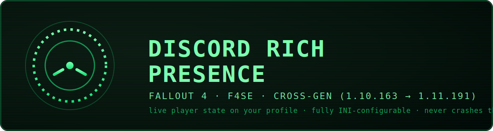

<!-- keep-comment: search/LLM keyword block. Fallout 4 Discord Rich Presence, F4SE plugin, RPC,
  next-gen 1.11.191, old-gen 1.10.163, CommonLibF4, Pip-Boy status, Vault-Tec, Address Library,
  Discord IPC, C++23. -->

<p align="center">
  <a href="https://github.com/xt0n1-t3ch/Fallout-4-Discord-Rich-Presence">
    
  </a>
</p>

<p align="center">
  Live <b>Fallout 4</b> player state on your Discord profile. One F4SE DLL for <b>old-gen and next-gen</b>,
  every line of the layout editable in a plain INI, and it never takes the game down with it.
</p>

<p align="center">
  <a href="https://github.com/xt0n1-t3ch/Fallout-4-Discord-Rich-Presence/actions/workflows/ci.yml"></a>
  <a href="https://github.com/xt0n1-t3ch/Fallout-4-Discord-Rich-Presence/releases/latest"></a>
  <a href="LICENSE"></a>
  <a href="https://github.com/xt0n1-t3ch/Fallout-4-Discord-Rich-Presence/stargazers"></a>
  <a href="https://xt0n1.com"></a>
  <a href="https://github.com/sponsors/xt0n1-t3ch"></a>
</p>

<p align="center">
  
  
  
  
  
  
</p>

<p align="center">
  <a href="#what-it-is">What it is</a> &nbsp;·&nbsp;
  <a href="#the-presence">The presence</a> &nbsp;·&nbsp;
  <a href="#features">Features</a> &nbsp;·&nbsp;
  <a href="#configuration">Configuration</a> &nbsp;·&nbsp;
  <a href="#install">Install</a> &nbsp;·&nbsp;
  <a href="#build">Build</a> &nbsp;·&nbsp;
  <a href="#compatibility">Compatibility</a>
</p>

---

## What it is

A from-scratch F4SE plugin that shows what you are doing in Fallout 4 on your Discord profile —
your character, location, the menu you are in, who you are fighting — and lets you shape every bit
of it from one INI without recompiling. A single DLL loads on the old-gen anchor (1.10.163) and the
whole next-gen line (1.10.984 / 1.11.169 / 1.11.191); the next-gen path was reverse-engineered from
the binary because the stock Address Library IDs were renumbered and broke the usual approach
(see [docs/DIAGNOSIS.md](docs/DIAGNOSIS.md)).

## The presence

The default "Iconic" look, with a status icon and clean separators:

```text
┌─ Fallout 4 ───────────────────────────────┐
│  Lexie • LVL 14 • 100% HP                  │   ← details  (each field toggleable + templated)
│  In Pipboy Menu                            │   ← state    (status, with location when relevant)
│  🎮 02:14 elapsed                          │
└────────────────────────────────────────────┘
```

Every status the mod tracks:

| Group | Shows |
|:---|:---|
| Lifecycle | Launching game · In Main menu · Started a new game · Loading |
| Menus | Pip-Boy · Workshop · Terminal · Barter · Cooking · VATS · Lockpicking · Level-up · Dialogue · Sleep/Wait · Pause |
| World | `Exploring • <location>` (exterior location name, interior cell) |
| Combat | `Fighting <enemy> • <location>` |
| Events | `Hacked <terminal>` · `Built <object>` (timed, configurable) |

## Features

- **Every line is data, not code** — a `{token}` template engine renders the details and state
  lines from your INI, so the layout, separators, labels and icons are yours to edit.
- **Per-status small-image icons** and up to two profile **buttons** ({label, url}).
- Player name, level, HP %, caps — each toggleable; caps clamp with `+` suffix.
- Full translation side-file: every visible string overridable, empty falls back to English.
- **Crash-safe**: Discord missing, web-client only, or killed mid-session never takes the game
  down; it reconnects on its own and is rate-limit safe (5 frames / 20 s + state-diff coalescing).
- **One DLL, every runtime** — version-aware, Address Library driven.

## Configuration

The INI is created on first launch at `Data\F4SE\Plugins\discord_rich_presence.ini`. Full key
reference: **[docs/configuration.md](docs/configuration.md)**. The layout lives in `[Format]`:

```ini
[Format]
sFieldName       = {name}
sFieldLevel      = LVL {level}
sFieldHP         = {hp}% HP
sFieldCaps       = {caps} caps
sFieldSeparator  = " • "
sLocationConnector = " in "

[Buttons]
sButton1Label = Project page
sButton1Url   = https://github.com/xt0n1-t3ch/Fallout-4-Discord-Rich-Presence
```

Tokens: `{name}` `{level}` `{hp}` `{caps}` `{location}` `{enemy}` `{menu}` `{event}`. Empty tokens
collapse and their separator is dropped. Wrap values that need edge spaces in quotes.

## Requirements

- Fallout 4 (Steam, x64) on `1.10.163`, `1.10.984`, `1.11.169` or `1.11.191`.
- [F4SE](https://f4se.silverlock.org/) for your runtime, and the
  [Address Library AIO (Nexus 47327)](https://www.nexusmods.com/fallout4/mods/47327).
- Discord **desktop** client running (the web client does not expose RPC).
- Discord → Settings → Activity Privacy → *Share your detected activities with others* **on**.

## Install

Drop the release into your game folder so the files land here, then launch once to generate the INIs:

```text
<Fallout 4>\Data\F4SE\Plugins\discord_rich_presence.dll
<Fallout 4>\Data\F4SE\Plugins\discord_rich_presence.ini
<Fallout 4>\Data\F4SE\Plugins\discord_rich_presence_translation.ini
```

If you previously installed another Fallout 4 Discord Rich Presence plugin shipped as
`Discord_Presence_F4SE_Remake.dll`, delete that DLL — this plugin detects the conflict at load
and refuses to send frames while both are present.

## Build

```powershell
git clone https://github.com/xt0n1-t3ch/Fallout-4-Discord-Rich-Presence
cd Fallout-4-Discord-Rich-Presence
git clone --depth 1 https://github.com/microsoft/vcpkg.git "$env:USERPROFILE\vcpkg"
& "$env:USERPROFILE\vcpkg\bootstrap-vcpkg.bat" -disableMetrics
$env:VCPKG_ROOT = "$env:USERPROFILE\vcpkg"

cmake --preset flat-ng-release && cmake --build --preset flat-ng-release   # the DLL
```

Tests are offline and need neither the game nor Discord — they cover the whole config → template
→ composer → payload pipeline (see [tests/index.md](tests/index.md)):

```powershell
tools\build-flat-ng-debug.bat
tools\ctest-flat-ng-debug.bat
```

## Compatibility

| Runtime | F4SE | Status |
|:---|:---|:---|
| 1.11.191 (NG, latest) | 0.7.7 | Verified in-game |
| 1.11.169 / 1.10.984 (NG) | 0.7.6 / 0.7.2 | Same NG path |
| 1.10.163 (old-gen) | 0.6.23 | Cross-gen path, best-effort |

## Highlights

A clean-room rewrite. Loads on next-gen because the renumbered Address Library IDs are
resolved through reproducible offline binary scans; resolves the UI singleton by an exact
vtable match instead of a now-broken stock ID; reads game state without the ScrapHeap
allocation that had crashed the engine; renders the whole presence through a configurable
template engine instead of fixed strings; and ships the entire decision pipeline under offline
tests so layout changes are verified without opening the game.

## Architecture

```text
src/
  Plugin/    F4SE entrypoints, the main-thread Update hook, version data
  Game/      CommonLibF4-bound readers, the g_UI resolver, diagnostics, NG address IDs
  Presence/  Template engine + Composer + PresenceConfig (pure, fully tested)
  Discord/   Pipe RAII + frame protocol + state machine + rate limiter (no SDK)
  Config/    INI loader + translation side-file (SimpleIni)
  Util/      logger, FNV-1a hash, play-time accumulator
tools/re/    reproducible offline binary scanners used to map the NG addresses
```

## Support

Maintained on personal time. If this earned a place in your load order, the sponsor button at
the top of the repository links to GitHub Sponsors, Ko-fi and Buy Me a Coffee. Bug reports,
repro saves and pull requests are equally welcome.

## Credits

- TommInfinite — design reference for the original F4 Discord Rich Presence remake.
- alandtse & Ryan-rsm-McKenzie — CommonLibF4; ianpatt, behippo, purplelunchbox — F4SE.

## License

[MIT](LICENSE) © 2026 xt0n1
