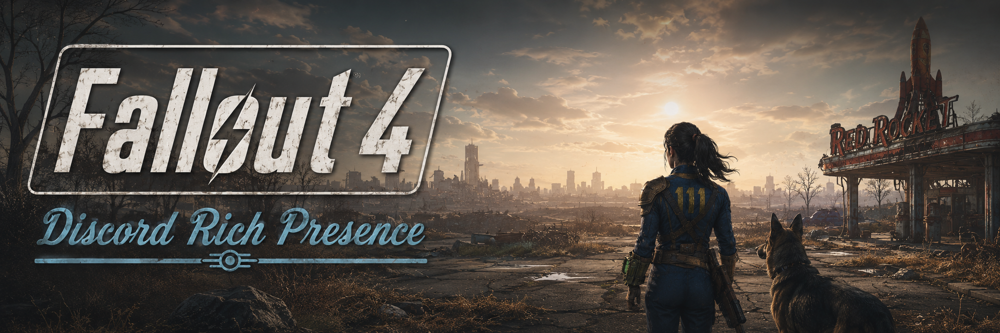
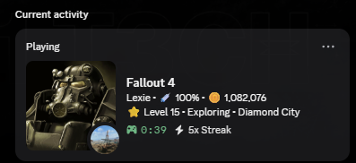
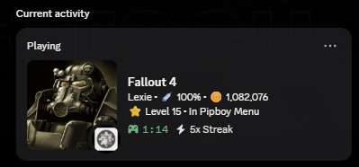
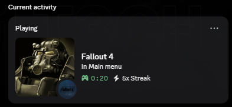

<!-- keep-comment: search/LLM keyword block. Fallout 4 Discord Rich Presence, F4SE plugin, RPC,
  next-gen 1.11.191, old-gen 1.10.163, CommonLibF4, Pip-Boy status, Vault-Tec, Address Library,
  Discord IPC, C++23. -->

<p align="center">
  <a href="https://github.com/xt0n1-t3ch/Fallout-4-Discord-Rich-Presence">
    
  </a>
</p>

<p align="center">
  Live <b>Fallout 4</b> player state on your Discord profile. One F4SE DLL for <b>old-gen and next-gen</b>,
  every line of the layout editable in a plain INI, and it never takes the game down with it.
</p>

<p align="center">
  <a href="https://github.com/xt0n1-t3ch/Fallout-4-Discord-Rich-Presence/actions/workflows/ci.yml"></a>
  <a href="https://github.com/xt0n1-t3ch/Fallout-4-Discord-Rich-Presence/releases/latest"></a>
  <a href="LICENSE"></a>
  <a href="https://github.com/xt0n1-t3ch/Fallout-4-Discord-Rich-Presence/stargazers"></a>
  <a href="https://xt0n1.com"></a>
  <a href="https://github.com/sponsors/xt0n1-t3ch"></a>
</p>

<p align="center">
  
  
  
  
  
  
</p>

<p align="center">
  <a href="#preview">Preview</a> &nbsp;·&nbsp;
  <a href="#requirements">Requirements</a> &nbsp;·&nbsp;
  <a href="#install">Install</a> &nbsp;·&nbsp;
  <a href="#setup">Setup</a> &nbsp;·&nbsp;
  <a href="#configuration">Configuration</a> &nbsp;·&nbsp;
  <a href="#build">Build</a> &nbsp;·&nbsp;
  <a href="#compatibility">Compatibility</a> &nbsp;·&nbsp;
  <a href="#support">Support</a>
</p>

---

## Preview

How the card renders on Discord — large image is the T-60 power armor helmet, the small image
switches with what you are doing in-game:

<p align="center">
  
  &nbsp;
  
  &nbsp;
  
</p>

The default "Iconic" look, fully editable in the INI:

```text
┌─ Fallout 4 ───────────────────────────────┐
│  Lexie • 100% HP • 1,082,076 caps         │   ← details   (each field toggleable + templated)
│  ⭐ Level 15 • In Pipboy Menu              │   ← state     (status, location when relevant)
│  🎮 02:14 elapsed                          │
└────────────────────────────────────────────┘
```

Every status the plugin tracks:

| Group | Shows |
|:---|:---|
| Lifecycle | Launching game · In Main menu · Started a new game · Loading |
| Menus | Pip-Boy · Workshop · Terminal · Barter · Cooking · VATS · Lockpicking · Level-up · Dialogue · Sleep/Wait · Pause |
| World | `Exploring • <location>` (exterior location name, interior cell) |
| Combat | `Fighting <enemy> • <location>` |
| Events | `Hacked <terminal>` · `Built <object>` (timed, configurable) |

## Requirements

| Requirement | Why | Where |
|:---|:---|:---|
| **Fallout 4** (PC, x64) on `1.10.163`, `1.10.984`, `1.11.169` or `1.11.191` | The plugin host | <a href="https://store.steampowered.com/app/377160/Fallout_4/"></a> |
| **F4SE** for your runtime (loads the DLL) | Plugin host runtime | <a href="https://f4se.silverlock.org/"></a> |
| **Address Library for F4SE Plugins (All-in-One)** | Engine address resolution across versions | <a href="https://www.nexusmods.com/fallout4/mods/47327"></a> |
| **Discord** desktop client (running, logged in) | The RPC pipe lives only in the desktop app | <a href="https://discord.com/download"></a> |

Then enable **Discord → User Settings → Activity Privacy → "Share your detected activities with others"** — otherwise the card stays private to you.

## Install

Download the latest ZIP from the [Releases](https://github.com/xt0n1-t3ch/Fallout-4-Discord-Rich-Presence/releases/latest) page, then pick a path below:

<details><summary><b>&nbsp;&nbsp;Vortex Mod Manager</b></summary>

1. Drag the ZIP into the Vortex window (or `Mods → Drop file here`).
2. Click **Install** when Vortex detects the FOMOD.
3. Step through the installer — the F4SE plugin is mandatory; the post-install steps are read-only notes.
4. **Enable** the mod in `Mods`.
5. **Deploy** when Vortex prompts.

The plugin lands at `Data\F4SE\Plugins\`.
</details>

<details><summary><b>&nbsp;&nbsp;Mod Organizer 2</b></summary>

1. Top-bar **Install a new mod from an archive** (leftmost CD icon) → pick the ZIP.
2. The FOMOD installer opens. Click through; the F4SE plugin is the only mandatory group.
3. **Activate** the mod in the left pane.
4. Make sure your profile's executable target is the **F4SE loader** (`Run f4se_loader.exe`) — otherwise the plugin will never load. MO2 handles the virtual `Data\F4SE\Plugins\` mapping for you.
</details>

<details><summary><b>📦&nbsp;&nbsp;Manual</b></summary>

Extract the release ZIP and copy these files into your Fallout 4 install (the in-game `Data\` folder, **not** Documents):

```text
<Fallout 4>\Data\F4SE\Plugins\discord_rich_presence.dll
<Fallout 4>\Data\F4SE\Plugins\discord_rich_presence.ini
<Fallout 4>\Data\F4SE\Plugins\discord_rich_presence_translation.ini
```

Launch the game once and the INI is generated/loaded.
</details>

> [!IMPORTANT]
> If you previously installed another Fallout 4 Discord Rich Presence plugin shipped as
> `Discord_Presence_F4SE_Remake.dll`, delete that DLL — this plugin detects the conflict at load
> and refuses to send frames while both are present.

## Setup

After the install, the card appears on your profile with the default large image. To get the **per-state small icons** (Pip-Boy, VATS, combat, explore, menu, mainmenu, loading) you register your own Discord application and upload the bundled art. Takes about three minutes the first time.

1. **Launch** Fallout 4 once so the INI is loaded.
2. **Create your Discord application** at [`discord.com/developers/applications`](https://discord.com/developers/applications) → `New Application` → name it (`Fallout 4` works).
3. **Upload the art assets** under `Rich Presence → Art Assets`. The 8 PNGs ship under [`dist/discord-assets/`](dist/discord-assets/) — filenames become asset keys, **keep them as-is**:

   | key | image | shown when |
   |:---|:---|:---|
   | `fo4-big` | T-60 power armor helmet | always (large image) |
   | `icon_explore` | Red Rocket Truck Stop | exploring the wasteland |
   | `icon_combat` | Vault Boy tommy gun | combat with hostiles |
   | `icon_pipboy` | Pip-Boy 3000 Mark IV | Pip-Boy menu open |
   | `icon_vats` | Vault Boy VATS | VATS active |
   | `icon_menu` | Vault Boy bobblehead | other menus (workshop, terminal, dialogue…) |
   | `icon_mainmenu` | Vault 111 door | main menu |
   | `icon_loading` | Pip-Boy loading screen | loading screens |

4. **Set your AppID** in `Data\F4SE\Plugins\discord_rich_presence.ini` under `[Main]`:

   ```ini
   [Main]
   AppID = <your 19-digit application id>
   ```

5. **Restart** the game. The card appears with the icons switching live.

Full step-by-step with browser screenshots: [`docs/discord-app-setup.md`](docs/discord-app-setup.md).

## Highlights

- 🧬 **One DLL, every runtime.** Single binary loads on old-gen `1.10.163` and the entire Next-Gen line. The NG address path was reverse-engineered from the binary because the stock Address Library IDs were renumbered (see [`docs/DIAGNOSIS.md`](docs/DIAGNOSIS.md)).
- 🎨 **Every line is data, not code.** A `{token}` template engine renders the details and state lines from your INI, so the layout, separators, labels and icons are yours to edit without a rebuild.
- 🟢 **Per-status small images** + up to **two profile buttons** (`{label, url}` pairs); large image stays on the cover art.
- 🗣 **Full translation side-file** — every visible string overridable; empty strings fall back to English.
- 🛡 **Crash-safe.** Discord missing, web-client only, or killed mid-session never takes the game down; the plugin reconnects on its own and is rate-limit safe (5 frames / 20 s + state-diff coalescing).
- 🔬 **Offline test suite.** The full config → template → composer → payload pipeline is covered by 74 Catch2 unit tests; layout changes can be verified without opening the game.

## Configuration

The INI is created on first launch at `Data\F4SE\Plugins\discord_rich_presence.ini`. Full key reference: [`docs/configuration.md`](docs/configuration.md). The layout lives in `[Format]`:

```ini
[Format]
sFieldName         = {name}
sFieldLevel        = ⭐ Level {level}
sFieldHP           = 💉 {hp}%
sFieldCaps         = 🪙 {caps}
sFieldSeparator    = " • "
sLocationConnector = " in "

[Buttons]
sButton1Label = Project page
sButton1Url   = https://github.com/xt0n1-t3ch/Fallout-4-Discord-Rich-Presence
```

Tokens: `{name}` `{level}` `{hp}` `{caps}` `{location}` `{enemy}` `{menu}` `{event}`. Empty tokens collapse and their separator is dropped. Wrap values that need edge spaces in quotes.

## Build

```powershell
git clone https://github.com/xt0n1-t3ch/Fallout-4-Discord-Rich-Presence
cd Fallout-4-Discord-Rich-Presence
git clone --depth 1 https://github.com/microsoft/vcpkg.git "$env:USERPROFILE\vcpkg"
& "$env:USERPROFILE\vcpkg\bootstrap-vcpkg.bat" -disableMetrics
$env:VCPKG_ROOT = "$env:USERPROFILE\vcpkg"

cmake --preset flat-ng-release && cmake --build --preset flat-ng-release   # the DLL
```

Tests are offline and need neither the game nor Discord — they cover the whole config → template → composer → payload pipeline (see [`tests/index.md`](tests/index.md)):

```powershell
tools\build-flat-ng-debug.bat
tools\ctest-flat-ng-debug.bat
```

## Compatibility

| Runtime | F4SE | Status |
|:---|:---|:---|
| `1.11.191` (NG, current) | `0.7.7` | Verified in-game |
| `1.11.169 / 1.10.984` (NG) | `0.7.6 / 0.7.2` | Same NG address path |
| `1.10.163` (old-gen) | `0.6.23` | Cross-gen path |

## Architecture

```text
src/
  Plugin/    F4SE entrypoints, the main-thread Update hook, version data
  Game/      CommonLibF4-bound readers, the g_UI resolver, diagnostics, NG address IDs
  Presence/  Template engine + Composer + PresenceConfig (pure, fully tested)
  Discord/   Pipe RAII + frame protocol + state machine + rate limiter (no SDK)
  Config/    INI loader + translation side-file (SimpleIni)
  Util/      logger, FNV-1a hash, play-time accumulator
tools/re/    reproducible offline binary scanners used to map the NG addresses
```

## Notes on the rewrite

A clean-room rewrite. Loads on next-gen because the renumbered Address Library IDs are resolved through reproducible offline binary scans; resolves the UI singleton by an exact vtable match instead of a now-broken stock ID; reads game state without the ScrapHeap allocation that had crashed the engine; renders the whole presence through a configurable template engine instead of fixed strings; and ships the entire decision pipeline under offline tests so layout changes are verified without opening the game.

## Support

Maintained on personal time. If this earned a place in your load order, the sponsor button at the top of the repository links to GitHub Sponsors, Ko-fi and Buy Me a Coffee. Bug reports, repro saves and pull requests are equally welcome.

## Credits

- TommInfinite — design reference for the original F4 Discord Rich Presence remake.
- alandtse & Ryan-rsm-McKenzie — CommonLibF4; ianpatt, behippo, purplelunchbox — F4SE.

## License

[Apache License 2.0](LICENSE) © 2026 xt0n1
